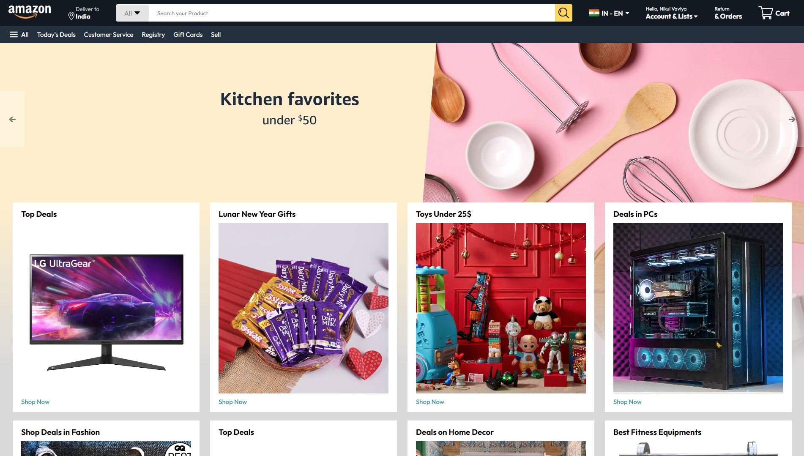

# Amazon Home Page Clone

This project is a clone of the Amazon Home Page, built using HTML, CSS, and JavaScript. The purpose of this project is to replicate the design and basic functionality of Amazon's main landing page.

## Features

- **Navigation Bar**: Fully functional navigation bar with links to different sections.
- **Product Sections**: Includes multiple product sections with sample images, titles, and prices.
- **Interactive Elements**: Some interactive elements like hover effects and clickable buttons.

## Screenshots

### Home Page View

## Technologies Used

- **HTML**: For the structure of the web page.
- **CSS**: For styling and layout.
- **JavaScript**: For adding interactivity.
